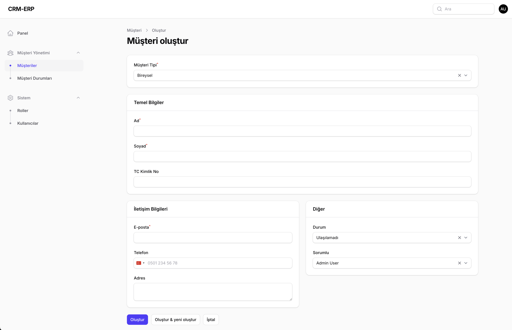

# 📌 CRM-ERP Project

CRM-ERP ihtiyaçlarını karşılamak üzere hazırlanmış temel bir projedir.  
Proje; müşteri takibi, müşteri durum yönetimi, kullanıcı ve rol yönetimi gibi modüllerin temelini içerir.  
Geliştirilebilir bir altyapı sunar.

---

## 📷 Panel Görseli

---

## 🚀 Özellikler

### ✅ Müşteri Yönetimi

-   Müşteri listesi
-   Müşteri detay görüntüleme
-   Müşteri oluşturma / güncelleme / silme

### ✅ Müşteri Durumları

-   Durum tanımlama
-   Duruma göre müşteri filtreleme

### ✅ Kullanıcı Yönetimi

-   Kullanıcı oluşturma / düzenleme / rol atama
-   Kullanıcı listesi

### ✅ Rol Yönetimi

-   Kullanıcı rollerinin tanımlanması
-   Role göre erişim kontrolü

---

## 🧭 Yol Haritası (Planned Features)

Aşağıdaki özelliklerin proje kapsamına dahil edilmesi planlanmaktadır:

### 🔹 Ürün Yönetimi

-   Ürün listesi
-   Ürün kategorileri
-   Ürün detay sayfası

### 🔹 Satış & Fatura Takibi

-   Fatura oluşturma
-   Fatura geçmişi görüntüleme

### 🔹 Stok Takibi

-   Stok miktarı kontrolü
-   Stok hareket geçmişi

---
